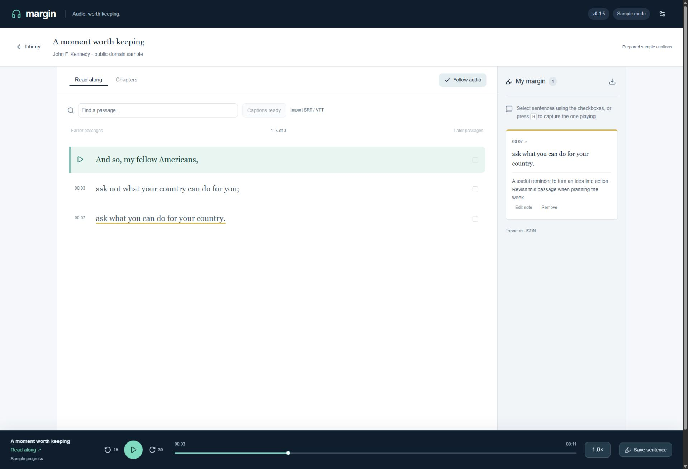
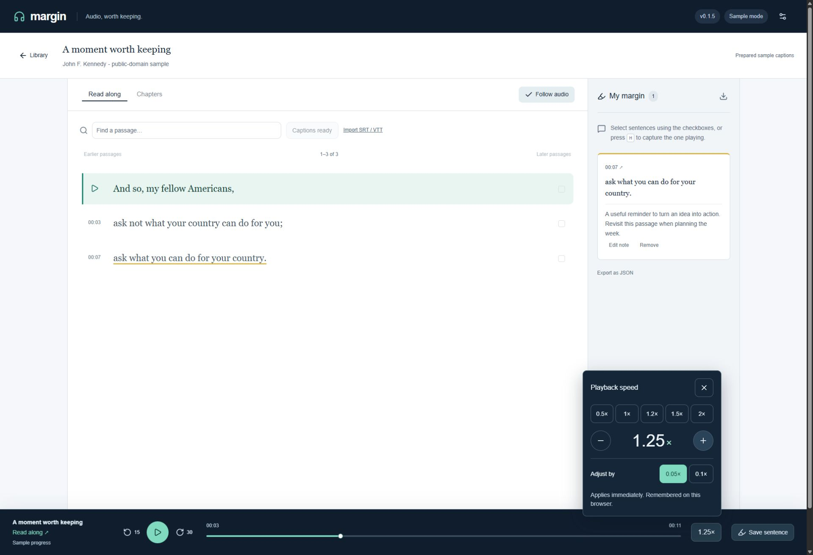
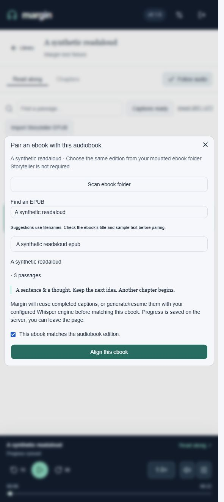
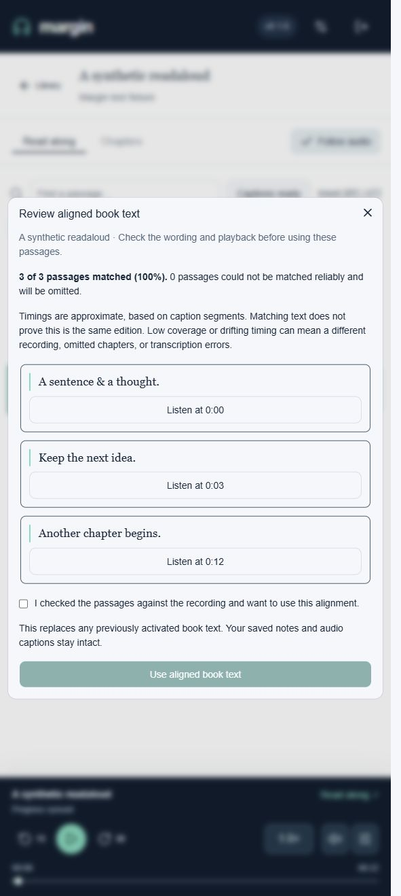
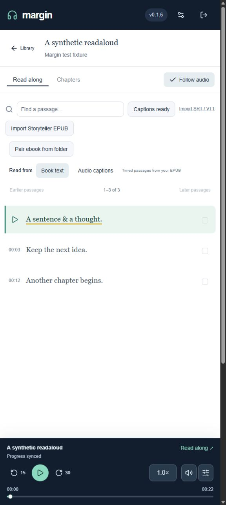

# Margin

Listen to your Audiobookshelf library, follow the book text or generated captions, and save highlights and notes linked to the audio. Margin runs on your own Docker host, with optional Intel, NVIDIA or CPU transcription.

**New in v0.1.6:** pair an ordinary EPUB from a mounted folder, align it inside Margin, and review the results before reading along. Storyteller is optional: you can also import an already aligned Storyteller EPUB.



*Actual app in sample mode, using a public-domain speech excerpt and prepared captions.*

- Read along with the active sentence, search passages, and jump to chapters.
- Pair EPUBs from your ebook folder, or import aligned Storyteller EPUBs.
- Save sentence highlights and notes; export them as Markdown or JSON.
- Keep listening while browsing your library, and fine-tune playback speed.
- Resume your listening position between Margin and Audiobookshelf.
- Generate captions with Intel/Vulkan, NVIDIA/CUDA, or CPU transcription. Import SRT/VTT when you already have captions.

Margin is an early, single-user application. Everyone using its password shares one library, notes collection, and Audiobookshelf account. It connects to an existing Audiobookshelf server; it does not replace one.

## Network security

For network access, configure HTTPS using [the HTTPS guide](docs/HTTPS.md). Version 0.1.6 rejects network HTTP unless explicitly acknowledged, and requires a unique password of at least 16 characters. Existing installations should read the migration guide before updating. See [hardening status](docs/SECURITY_HARDENING.md) for implemented protections and remaining work.

## Before you install

You need:

1. A working [Audiobookshelf server](https://www.audiobookshelf.org/) with at least one playable audiobook.
2. A Linux machine or VM with Docker Engine and the Docker Compose plugin. Windows/macOS Docker users can use Linux CPU containers, but those hosts have not been fully tested.
3. An Audiobookshelf API key for the account whose library and listening progress you want to use.
4. Storage for container images, a Whisper model, and the largest audiobook audio file being transcribed. Model and memory needs vary; start with `base.en` if resources are limited. The default is `small.en`.

You do not need a GPU on the device running your browser. A GPU in the Docker host is optional and only accelerates transcription.

## Install the all-in-one image

The all-in-one image includes Margin and its transcription worker in **one container**. No source download or local build is required. Audiobookshelf still runs separately.

Pick the **versioned all-in-one image** for your Docker host. The plain `v0.1.6` tag is app-only; use an `-aio-` tag for the complete single-container installation:

| Hardware | Pull command |
| --- | --- |
| CPU (amd64 / arm64) | `docker pull ghcr.io/oscarsworldtech/margin:v0.1.6-aio-cpu` |
| Intel / experimental AMD (amd64) | `docker pull ghcr.io/oscarsworldtech/margin:v0.1.6-aio-vulkan` |
| NVIDIA (amd64) | `docker pull ghcr.io/oscarsworldtech/margin:v0.1.6-aio-cuda` |

For a first CPU installation, configure your HTTPS proxy and its exact `TRUSTED_PROXIES` address using the guide above, then:

1. Create an Audiobookshelf API key using the [instructions below](#3-create-your-audiobookshelf-api-key).
2. Create a file named `margin.env` in your installation folder with these values. For this Docker `--env-file` format, **do not put quotes around the values**:

   ```dotenv
   ABS_URL=https://YOUR-AUDIOBOOKSHELF-HOST
   ABS_TOKEN=YOUR-API-KEY
   MARGIN_PASSWORD=CHOOSE-A-LONG-UNIQUE-PASSWORD
   TRUSTED_PROXIES=YOUR_EXACT_PROXY_PEER_IP
   COOKIE_SECURE=true
   WHISPER_MODEL=small.en
   WHISPER_LANGUAGE=en
   ```

   Use an Audiobookshelf address reachable from inside Docker. `localhost` here would point at the Margin container.

3. Pull and start the image:

   ```sh
   docker pull ghcr.io/oscarsworldtech/margin:v0.1.6-aio-cpu
   docker run -d --name margin --restart unless-stopped \
     --env-file margin.env \
     -p 127.0.0.1:8787:8787 \
     -v margin-data:/data \
     -v whisper-models:/models \
     ghcr.io/oscarsworldtech/margin:v0.1.6-aio-cpu
   ```

4. Follow `docker logs -f margin` until the first model download and Whisper startup finish. Open **your configured HTTPS address**, sign in with your Margin password, open a book, and choose **Generate captions**.

This publishes port 8787 on host loopback for your same-host HTTPS proxy. Saved captions and notes live in `margin-data`; models live in `whisper-models`. Keep both volumes when updating.

Intel and NVIDIA need additional GPU options. The [all-in-one guide](docs/ALL_IN_ONE.md) includes those options, single-container Compose files, updates, diagnostics, and migration from the previous two-container setup. Existing installations should follow that guide to reuse their actual volume names.

## Install with separate containers

### 1. Download Margin

Download **margin-v0.1.6-install.zip** from the [v0.1.6 release](https://github.com/OscarsWorldTech/margin/releases/tag/v0.1.6). Extract it on your Docker host and open a terminal in the extracted `margin` folder. Keep the complete folder together, including `.env.example`.


### 2. Choose your hardware

Run **one** command in that folder:

| Docker host | Command | Requirements |
| --- | --- | --- |
| CPU, Linux amd64 or arm64 | `sh setup.sh cpu` | No GPU setup; slower transcription |
| Intel GPU, Linux amd64 | `sh setup.sh intel` | Working host driver and `/dev/dri` render device; Arc A310 has been tested |
| NVIDIA GPU, Linux amd64 | `sh setup.sh nvidia` | Compatible NVIDIA driver and NVIDIA Container Toolkit configured for Docker |
| AMD GPU, Linux amd64 | `sh setup.sh amd` | Vulkan-capable host driver and `/dev/dri`; experimental |

The helper creates `.env` and saves your hardware choice. It does not install drivers. NVIDIA and AMD GPU inference still need hardware validation. Read [hardware setup and troubleshooting](docs/HARDWARE.md) for passthrough, drivers, alternate render nodes, and compatibility details.

### 3. Create your Audiobookshelf API key

In the Audiobookshelf web app, an administrator can open **Settings → Users → API Keys** and create a key named **Margin**. Select the user you listen as, make the key active, then copy it when shown. The key inherits that user's permissions and listening progress. Keep track of any expiration date. See the [official API key guide](https://audiobookshelf.org/docs/documentation/server-management/api-keys/).

Older Audiobookshelf versions expose a user API token under the user's settings instead. Margin's setting is called `ABS_TOKEN` for both forms. Do not use a short-lived browser session token or include `Bearer ` in the value. Keep the key in `.env`, out of screenshots and Git commits.

### 4. Edit `.env`

Open `.env` in a text editor and replace these values:

```dotenv
ABS_URL=https://YOUR-AUDIOBOOKSHELF-HOST
ABS_TOKEN='YOUR-API-KEY'
MARGIN_PASSWORD='CHOOSE-A-LONG-UNIQUE-PASSWORD'
BIND_ADDRESS=127.0.0.1
```

- `ABS_URL` must be reachable **from inside Docker**. Include the full subpath if your server uses one. `localhost` inside Margin means the Margin container, not your Audiobookshelf host.
- `MARGIN_PASSWORD` is the password for opening Margin, not your Audiobookshelf password. Single quotes preserve literal characters such as `$` and `#`; avoid a literal single quote in this value.
- Keep `BIND_ADDRESS=127.0.0.1` for a same-host proxy. Configure `TRUSTED_PROXIES`, `COOKIE_SECURE=true`, and your external `ALLOWED_ORIGINS` as described in the HTTPS guide. A different-host proxy needs a restricted bind address/firewall.

Keep the hardware selection written by setup.sh and `MARGIN_VERSION=v0.1.6`. For non-English audio, choose a multilingual model such as `small` and set `WHISPER_LANGUAGE=auto` or a language code. Sentence splitting currently follows English punctuation conventions.

### 5. Start the services

```sh
docker compose pull
docker compose up -d
docker compose logs -f whisper
```

The first startup downloads the selected model. Wait for Whisper to start its server; press Ctrl+C to stop following logs (the services keep running). Then check:

```sh
sh doctor.sh
```

Open **your configured HTTPS address** in your browser and sign in with your Margin password. If the browser cannot connect, check the bind address, host firewall and whether both containers are running. If the library cannot load, check `ABS_URL`, the API key, and the selected user's permissions. Restart Margin after editing `.env` with `docker compose up -d`.

### 6. Transcribe your first book

Choose an Audiobookshelf library, open a short book, and click **Generate captions**. Margin processes audio in sections and saves each completed section. Keep the Docker host running while transcription proceeds; you can close the browser. Use **Pause after this section** and **Resume captions** to continue later.

Press Play to read along. Click a passage timestamp to replay it, select a sentence to add a highlight or note, and use the speed button to adjust listening speed. Your original audio files are not changed.



See [listening, notes, sync and limitations](docs/USAGE.md) for keyboard shortcuts, exports, and using another Audiobookshelf client.

## Read along with an ebook

You need a DRM-free EPUB of the **same edition** as the recording in Audiobookshelf.
Mount its folder read-only using the supplied `compose.ebooks.yml` overlay, then:

1. Open the audiobook and choose **Pair ebook from folder**.
2. Scan, select the EPUB, and check its metadata and sample wording.
3. Choose **Align this ebook**. Margin reuses captions or generates them locally.
4. Review coverage and listen to sample passages before choosing **Use aligned book text**.

See [complete folder setup](docs/EBOOKS.md) for the mount and update commands.
Timings are approximate: this matches ebook text to caption segments, and omits
unmatched passages. Your original captions and saved notes are preserved.
Already have an aligned EPUB? Use [Import Storyteller EPUB](docs/STORYTELLER.md).

<p>
  
  
  
</p>

*Fresh v0.1.6 app screenshots in a narrow browser layout, using synthetic test
text. The sample demonstrates the workflow, not real-book alignment accuracy.*

## Already installed?

Follow the [upgrade guide](docs/UPGRADING.md). Keep your existing `.env`, deployment folder, Compose project name, and named volumes so captions, notes, listening positions and model downloads are retained. Do not use `docker compose down -v` when upgrading.

## Try a sample or contribute

The [development guide](docs/DEVELOPMENT.md) explains sample mode, local setup, source builds and checks. Sample mode needs no Audiobookshelf account or GPU and uses a short public-domain recording with prepared captions. It demonstrates listening and note taking, not automatic transcription quality.

## Storage and privacy

`margin-data` holds the SQLite database and temporary transcription audio. `whisper-models` holds downloaded models. Back up the data volume while Margin is stopped, or use a SQLite-aware backup. Completed source tracks are removed from the cache; paused or failed transcription may retain its current track until it can resume.

Audio is sent to your local transcription worker. Installation and the initial model download require internet access. Notes are stored in Margin rather than Audiobookshelf. Sessions expire after seven days or a server restart. Configure HTTPS proxy trust and cookie behavior using [the HTTPS guide](docs/HTTPS.md); an allowed origin alone does not verify transport security.

## Sources and credits

- Speed-control behavior follows the preset/stepper pattern in [Audiobookshelf’s playback speed control](https://github.com/advplyr/audiobookshelf/blob/master/client/components/controls/PlaybackSpeedControl.vue); Margin uses its own React implementation.

- [Audiobookshelf](https://github.com/advplyr/audiobookshelf), its [current progress controller](https://github.com/advplyr/audiobookshelf/blob/master/server/controllers/MeController.js), and its [API reference](https://api.audiobookshelf.org/). The reference labels itself outdated; integration should be tested against your server version.
- [whisper.cpp](https://github.com/ggml-org/whisper.cpp), including its [Vulkan and Intel backend documentation](https://github.com/ggml-org/whisper.cpp#vulkan-gpu-support).
- Sample audio: [JFK excerpt distributed in whisper.cpp](https://github.com/ggml-org/whisper.cpp/blob/v1.8.2/samples/jfk.wav), from the 1961 US presidential inaugural address. Prepared sample captions are approximate.
- UI uses React, Base UI/Shadcn and Lucide. Their respective licenses apply.
