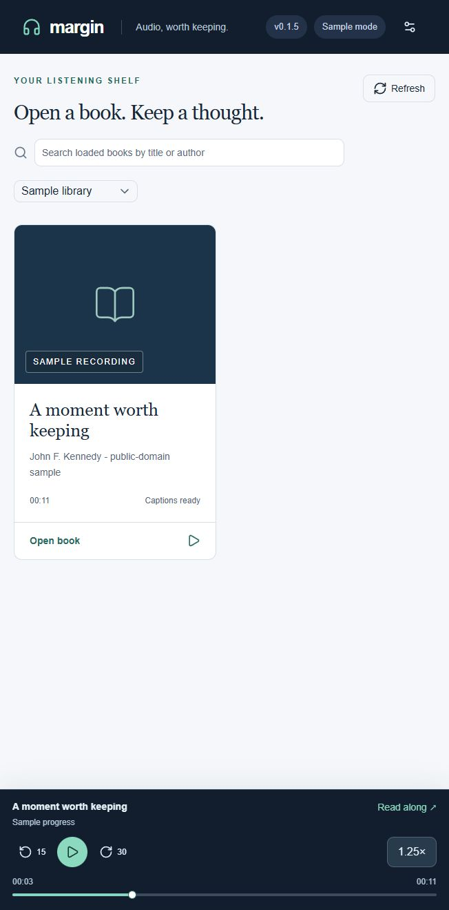

# Listening and notes

## Playback

The player stays active when you click Library or the Margin logo. Click the book title in the player to return to its captions. Opening another book saves the old position and loads the new book paused. Reloading or closing the browser stops playback.

The speed panel has presets and 0.05× / 0.1× adjustment steps. Speed and step size are remembered in this browser. Speeds range from 0.5× to 10×, subject to browser support; very high speeds can mute audio or reduce quality. The browser is asked to preserve pitch. Speed does not change the timestamps used for captions and sync.

## Volume

Use the speaker button to mute or unmute, and the adjacent volume-controls button for the 0–100% slider. Volume and mute are remembered in this browser. Raising the slider unmutes; unmuting from zero restores the last audible level. These controls remain available while browsing the library. Some mobile browsers require the device's physical volume buttons.

## Captions and notes

Use Follow audio to keep the active passage visible. Searching or manually browsing passages turns following off. Only 80 passages render at once so long books remain responsive. Use Earlier/Later passages to browse.

Select sentences with their checkboxes or select text across passages. Add a thought, choose a highlight color, and save. Press **H** to select the active sentence or **Space** to play/pause when focus is outside an interactive control. You can edit or remove saved notes and export Markdown or JSON. Removal has no undo; export before cleanup.

Import SRT/VTT captions if you already have them. The settings dialog can adjust caption timing for the current session. Notes keep their saved quote even if captions are replaced.

## Audiobookshelf progress sync

Sync uses the account associated with `ABS_TOKEN`. Pause in one client before continuing in another. Margin reads progress before playback and checks every 15 seconds while paused, on focus and when returning to the tab. During playback, it saves progress roughly every 15 seconds and on pause/seeks; it does not jump to another device's position while playing.

Failed writes show a status and retry while the page is open. Switching books or signing out waits for unsaved progress. Settings also offers Sync progress now. Abrupt browser or network termination can lose progress since the last successful save; failed writes are not stored in an offline queue. Audiobookshelf listening-session statistics are not reported.

## Limits

- Recognition can mishear names or omit words. Sentence boundaries inside a recognition segment use estimated timing, not word-level forced alignment.
- Changes to the source audiobook require replacing its captions or manually resetting its stored transcript/job. Automatic audio fingerprinting is not implemented.
- Track transitions can have a short gap. Playback depends on browser codec support; no HLS fallback, offline downloads or native mobile app is included.
- Simultaneous clients can overwrite listening position. Notes are shared storage, but there is no live multi-device note merge interface.
- A source download or inference call may take time to stop. Failed caption jobs require Resume; retries do not run forever.
- NVIDIA and AMD GPU inference remain unverified. See [hardware compatibility](HARDWARE.md).
